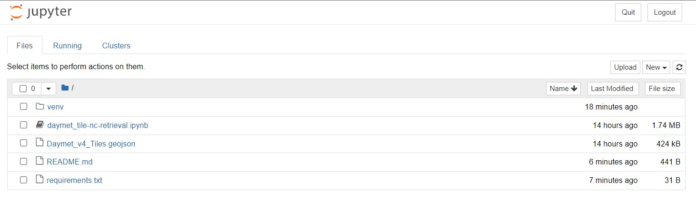
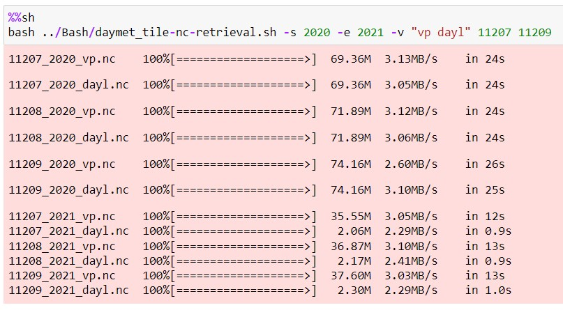
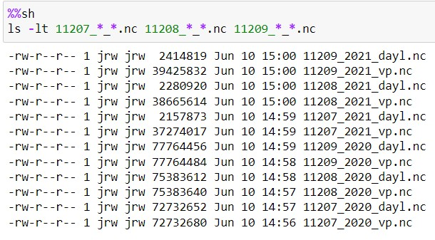

# Interact with Daymet Tile Grid and examples for automating downloads for multiple tiles 
This directory contains a Jupyter Notebook program that provides an interactive map and examples on how to use the tile download automation script. 

# Instructions
## Setting up the map
1. Install requirements with `pip`
```bash
       $ pip install -r requirements.txt 
```
2. In this directory (`/path/to/daymet-TDSTiles-Batch/Python`) run `jupyter notebook`
```bash
       $ jupyter notebook
```
3. In your browser navigate to `http://localhost:8888/tree`. You should see a page containing this: 

4. Click on `daymet_tile-nc-retrieval.ipynb` to open the notebook.

5. Run the first two code cells to create and display the map.

6. Click on the tiles on map to open pop-ups containing the selected tile's ID, and boundary coordinates.


## Examples in notebook
The rest of this notebook contains examples of how to use the daymet_tile-nc-retrieval.sh script. You can run the examples that interest you.

### Example run


After downloading the files you can run the cell below the example to run a ls command to make sure the files were downloaded.



   


  
