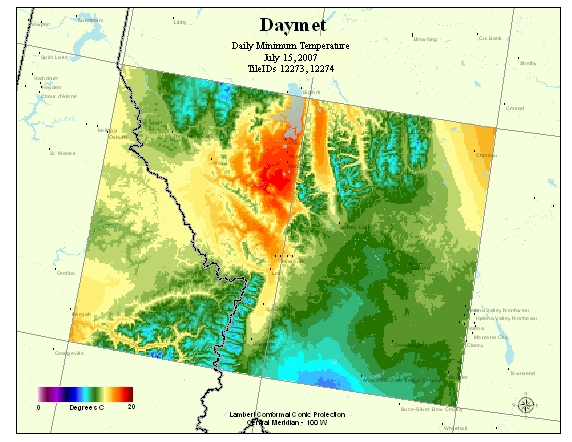
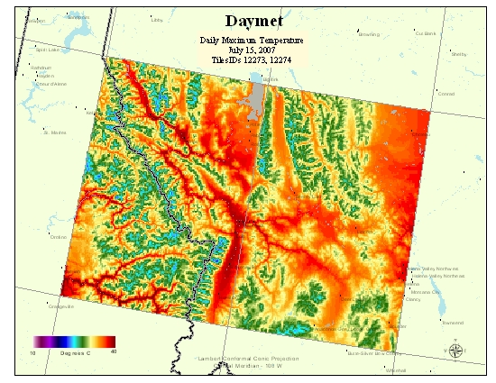
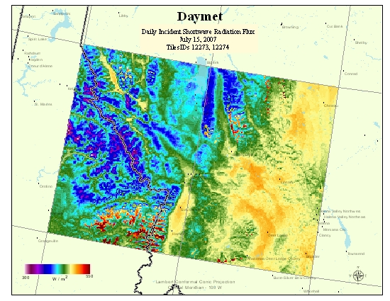
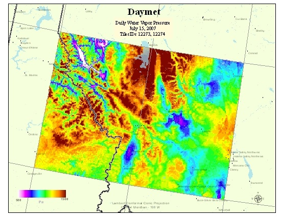
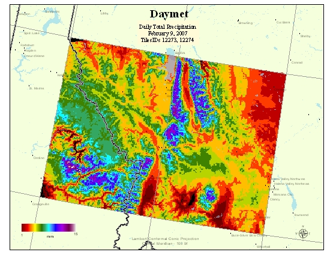
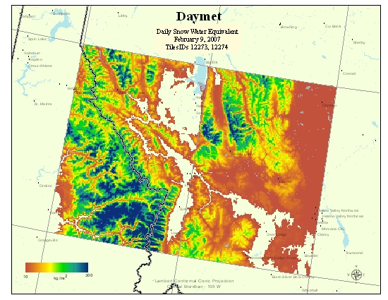
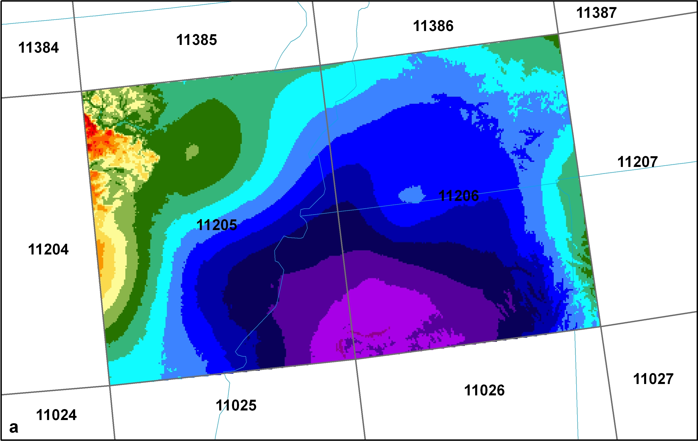
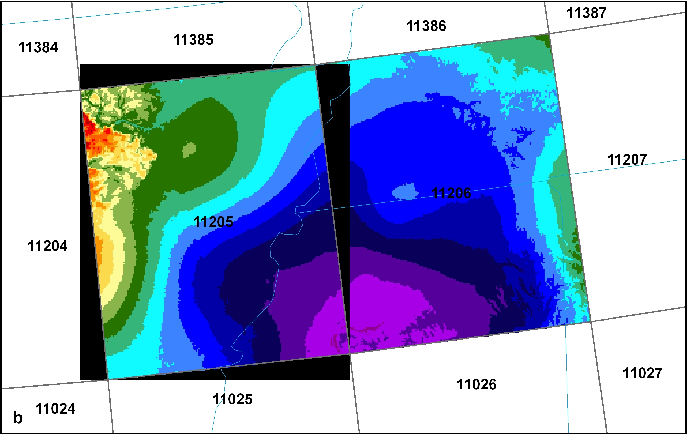

# Automate Download of Daymet Daily 2-degree Tiles
This repo contains methods for automating the download of 2-degree tiles of Daymet daily data hosted on the ORNL DAAC [THREDDS Data Server](https://thredds.daac.ornl.gov/thredds/catalog/ornldaac/1840/tiles/catalog.html).  Consult the [Daymet 2-degree tile image](https://daymet.ornl.gov/static/graphics/TilesV4_Daymet.png) or see the Jupyter Notebook under Python methods for guidance on tile IDs.  

## Methods
1. [Bash](./Bash/README.md) 
2. Python 

## Background

The Daymet algorithm manages the large number of input data and large spatial extent of the study area by creating a system of 2-degree x 2-degree tiles which are processed individually through the Daymet software. These tiles are identified by a TileID which is derived within the Daymet algorithm and is consistent throughout the temporal period of the Daymet record. 

A [Thematic Real-time Environmental Data Services (THREDDS)](https://thredds.daac.ornl.gov/thredds/catalogs/ornldaac/Regional_and_Global_Data/DAYMET_COLLECTIONS/DAYMET_COLLECTIONS.html) server provides the contents of the CF-Compliant NetCDF Daymet collection.

When downloaded, the daily gridded tile data contain individual netCDF files for each Daymet variable: minimum and maximum temperature, precipitation, incident shortwave radiation, water vapor pressure, snow water equivalent, and day-length. The spatial resolution of the raster data is 1 km, and each file is spatially referenced to the Lamber Conformal Conic projection. Example images of Daymet variables are shown below for two Daymet tiles in the Rocky Mountain West covering the northern border of Idaho and Montana. The Daymet TileIDs for these two tiles are 12273 and 12274. Recall that each netCDF file contains daily data for each Daymet variable. The images show just one day of the 365 days available in each netCDF file. Also note adjacent tiles match seamlessly.

#### Daymet Daily Variables; tmin, tmax, srad, vp (July 15,2007), and prcp, and swe (February 9,2007)

| | | |
|:-------------------------:|:-------------------------:|:-------------------------:|
||||
||| |

### No Data in 2-degree Tiles

No Data values buffer the rectangular extent of each of the Daymet variable netCDF files due to the spatially explicit raster content of the data. For example, pictured below are two adjacent Daymet tiles showing Day 1 of the maximum temperature variable in year 2008. As shown in the figures, the pixel values on the adjacent edge of each tile match seamlessly. In the figure on the right, nodata values for the file in Tile 11205 are symbolized in black showing the actual extent of the raster file.

|||
|:-------------------------:|:-------------------------:|
|||

## Data Availability

|Region| Availability|
|:-----------:|:-----------:|
|Puerto Rico|1950 – present full year (tileID’s 9597, 9598, 9777, 9778)|
|Continental North America|1980 – present full year|
|Hawaii| 1980 – present full year|

## Data Use Citation
Thornton, M.M., R. Shrestha, Y. Wei, P.E. Thornton, S. Kao, and B.E. Wilson. 2020. Daymet: Daily Surface Weather Data on a 1-km Grid for North America, Version 4. ORNL DAAC, Oak Ridge, Tennessee, USA. https://doi.org/10.3334/ORNLDAAC/1840

## More Information

More information about the Daymet dataset including all access methods is found at the [Daymet Project Home Page](https://daymet.ornl.gov/).